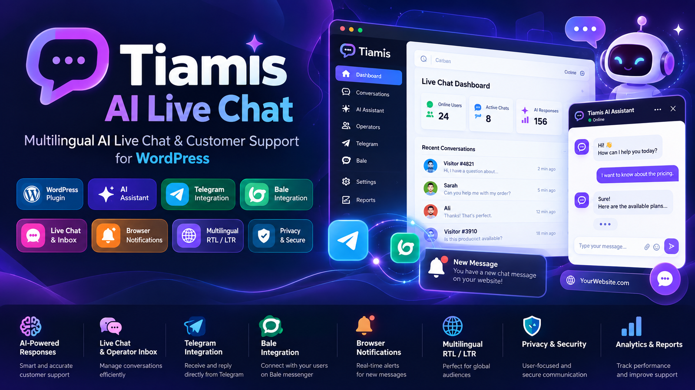
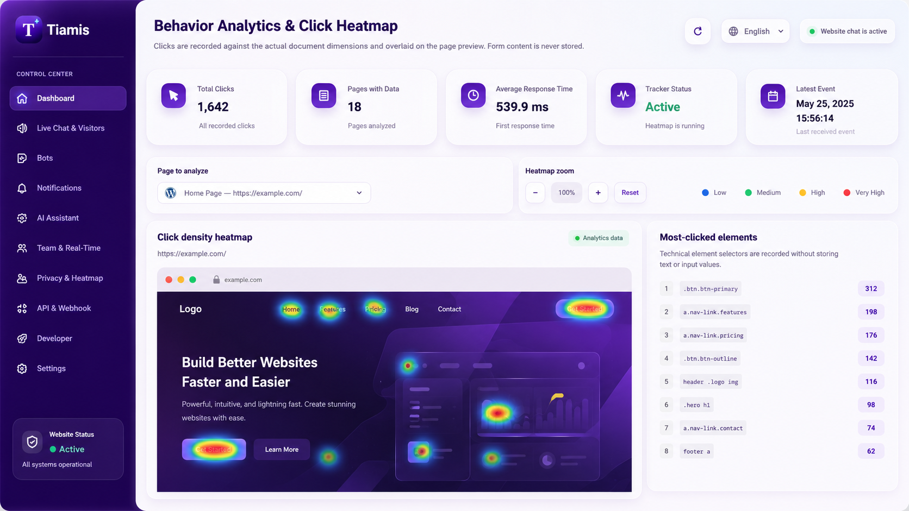

# 🤖 Tiamis AI Live Chat



**AI-Powered Multilingual Customer Communication Platform for
WordPress**


------------------------------------------------------------------------

## 🌐 Documentation

-   [🇬🇧 English](#-english)
-   [🇸🇦 العربية](#-العربية)
-   [🇮🇷 فارسی](#-فارسی)

------------------------------------------------------------------------

# 🇬🇧 English

## Overview

Tiamis AI Live Chat is a professional WordPress live communication and
customer support plugin that combines website chat, Telegram, Bale
messaging, AI assistance, operator management, browser notifications,
privacy tools and multilingual capabilities.

Tiamis is built for businesses, agencies, online stores, support teams
and developers who need a unified communication center inside WordPress.

## Main Features

### 💬 Live Chat Widget

-   Floating chat widget
-   Shortcode support: `[shcd_tiamis]`
-   Real-time visitor conversations
-   Responsive interface
-   Customer interaction management

### 🧠 AI Assistant

-   AI reply suggestions
-   Automatic response mode
-   Cloudflare Workers AI support in Free edition
-   PRO providers preview:
    -   OpenRouter
    -   OpenAI-compatible API
    -   Ollama

### 👥 Operator Workspace

-   Unified inbox
-   Multiple operators
-   Conversation assignment
-   Priority management
-   Tags
-   Internal notes
-   Tasks
-   Customer history

### 📱 Messaging Integrations

-   Telegram Bot integration
-   Bale integration
-   Two-way messaging workflow
-   Webhook and polling support

### 🌍 Multilingual System

Supported languages:

-   Persian
-   Arabic
-   English

Features:

-   RTL support
-   LTR support
-   Translation-ready architecture

### 🔔 Notifications

-   Browser notifications
-   Web Push support
-   New conversation alerts

### 🔐 Privacy & Security

-   WordPress capability validation
-   Nonce protection
-   Rate limiting
-   Honeypot protection
-   SSRF protection
-   Privacy export and erase tools
-   Configurable IP retention

------------------------------------------------------------------------

# 🆚 Free vs Pro Comparison

  Feature                 Free            Pro
  ----------------------- --------------- -----------------------
  Live Chat Widget        ✅              ✅
  Unified Inbox           ✅              ✅
  Telegram Integration    ✅              ✅ Advanced
  Bale Integration        ✅              ✅ Advanced
  AI Assistant            Cloudflare AI   Multiple AI Providers
  OpenRouter              ❌              ✅
  OpenAI Compatible API   ❌              ✅
  Ollama                  ❌              ✅
  Ticket System           ❌              ✅
  Heatmap Analytics       ❌              ✅
  External REST API       ❌              ✅
  Webhook Automation      ❌              ✅
  Advanced Reports        ❌              ✅

------------------------------------------------------------------------

# 📸 Screenshots

## Dashboard



More screenshots:

``` text
assets/screenshots/
├── dashboard.png
├── chat-widget.png
├── inbox.png
├── settings.png
└── integrations.png
```

------------------------------------------------------------------------

# 🇸🇦 العربية

## نظرة عامة

Tiamis AI Live Chat إضافة احترافية لـ WordPress لإنشاء مركز اتصال ذكي
يجمع الدردشة المباشرة والذكاء الاصطناعي ورسائل Telegram وBale وإدارة
فريق الدعم.

## المميزات

### الدردشة المباشرة

-   نافذة دردشة حديثة
-   محادثات فورية
-   دعم الشورت كود
-   إدارة الزوار

### الذكاء الاصطناعي

-   اقتراح الردود
-   الرد التلقائي
-   Cloudflare Workers AI في النسخة المجانية
-   مزودات AI إضافية في Pro

### إدارة الفريق

-   صندوق محادثات موحد
-   توزيع المحادثات
-   الأولوية
-   الوسوم
-   الملاحظات

### التكاملات

-   Telegram
-   Bale
-   Webhook

### اللغات

-   العربية
-   الفارسية
-   الإنجليزية

دعم:

-   RTL
-   LTR

------------------------------------------------------------------------

# مقارنة Free و Pro

  الميزة             Free   Pro
  ------------------ ------ -------
  الدردشة المباشرة   ✅     ✅
  Telegram           ✅     متقدم
  Bale               ✅     متقدم
  مزودات AI متعددة   ❌     ✅
  نظام التذاكر       ❌     ✅
  Heatmap            ❌     ✅
  API خارجي          ❌     ✅

------------------------------------------------------------------------

# 🇮🇷 فارسی

## معرفی

Tiamis AI Live Chat یک افزونه حرفه‌ای وردپرس برای ایجاد مرکز ارتباط با
مشتری است که چت آنلاین، هوش مصنوعی، تلگرام، بله، مدیریت اپراتورها و
ابزارهای امنیتی را در یک سیستم یکپارچه ارائه می‌کند.

## قابلیت‌ها

### چت آنلاین

-   ویجت چت شناور
-   شورت‌کد `[shcd_tiamis]`
-   مدیریت گفتگوها
-   طراحی واکنش‌گرا

### هوش مصنوعی

-   پیشنهاد پاسخ هوشمند
-   پاسخ خودکار
-   Cloudflare Workers AI در نسخه رایگان
-   OpenRouter، OpenAI Compatible و Ollama در نسخه PRO

### مدیریت تیم پشتیبانی

-   صندوق گفتگو
-   چند اپراتور
-   تخصیص مکالمه
-   اولویت
-   برچسب
-   یادداشت
-   وظایف

### اتصال پیام‌رسان‌ها

-   Telegram
-   Bale
-   Webhook

### چندزبانه

پشتیبانی:

-   فارسی
-   عربی
-   انگلیسی

امکانات:

-   RTL
-   LTR

------------------------------------------------------------------------

# مقایسه نسخه Free و Pro

  قابلیت            Free    Pro
  ----------------- ------- ---------
  چت آنلاین         ✅      ✅
  صندوق گفتگو       ✅      ✅
  تلگرام            ✅      پیشرفته
  بله               ✅      پیشرفته
  Provider های AI   محدود   کامل
  Ticketing         ❌      ✅
  Heatmap           ❌      ✅
  API خارجی         ❌      ✅
  Automation        ❌      ✅

------------------------------------------------------------------------

# 🚀 Installation

1.  Upload plugin ZIP.
2.  Activate Tiamis from WordPress Plugins.
3.  Configure:
    -   Chat widget
    -   Operators
    -   Bots
    -   AI provider
    -   Notifications

------------------------------------------------------------------------

# 📝 Changelog

## 1.0.0

-   Initial release
-   Multilingual live chat
-   Telegram and Bale integrations
-   AI assistant
-   Operator management
-   Privacy tools
-   PRO feature previews

------------------------------------------------------------------------

# 🛣 Roadmap

-   Advanced ticketing
-   More AI providers
-   Advanced analytics
-   Automation workflows
-   Additional integrations

------------------------------------------------------------------------

# 📄 License

GPL-2.0-or-later

------------------------------------------------------------------------

# Developer

Developed by <a href="https://shabnam.dev"> SHABNAM.DEV </a>
