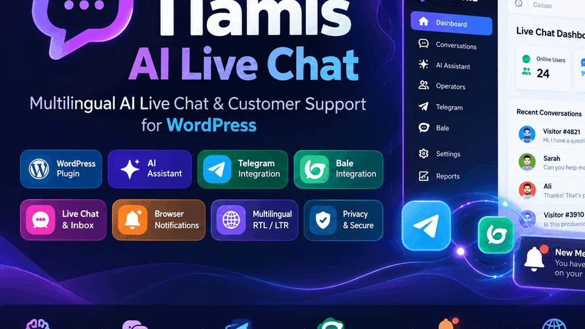

<p align="center">

</p>

# 🤖 Tiamis – AI Live Chat

<p align="center">
<strong>Multilingual AI Live Chat & Customer Support Platform for WordPress</strong>
</p>

<p align="center">


</p>

# 📚 Contents

- 🇬🇧 English
- 🇸🇦 العربية
- 🇮🇷 فارسی
- ✨ Features
- 🆚 Free vs Pro Comparison
- 📸 Screenshots
- 🔐 Security
- 📝 Changelog
- 🚀 Roadmap

---

# 🇬🇧 English

## Overview

Tiamis AI Live Chat is a professional WordPress customer communication plugin that combines AI-assisted conversations, live chat support, multilingual messaging, and external platform integrations.

It helps businesses provide faster support through an intelligent chat widget, operator inbox, AI assistance, Telegram and Bale connectivity, notifications, and privacy-focused controls.

## Key Features

- AI-assisted customer support
- Smart live chat widget
- Operator inbox management
- Telegram integration
- Bale integration
- Persian, Arabic and English support
- RTL/LTR interface
- Browser notifications
- Conversation tags and management
- Privacy controls

---

# 🇸🇦 العربية

## نبذة

Tiamis AI Live Chat إضافة احترافية لـ WordPress توفر نظام محادثة ذكي لدعم العملاء باستخدام الذكاء الاصطناعي.

تجمع بين الدردشة المباشرة، إدارة المحادثات، التكامل مع Telegram وBale، دعم اللغات المتعددة، والإشعارات الحديثة.

## المميزات

- مساعد ذكي للردود
- صندوق محادثات موحد
- دعم العربية والفارسية والإنجليزية
- دعم RTL/LTR
- إدارة العملاء والمحادثات
- تكامل Telegram وBale
- أدوات الخصوصية

---

# 🇮🇷 فارسی

## معرفی

Tiamis AI Live Chat یک افزونه حرفه‌ای وردپرس برای پشتیبانی آنلاین، چت هوشمند و مدیریت ارتباط با مشتری است.

این افزونه با استفاده از هوش مصنوعی، صندوق مدیریت گفتگو، اتصال Telegram و Bale، اعلان‌ها و پشتیبانی چندزبانه، یک سیستم کامل ارتباطی ایجاد می‌کند.

## امکانات

- پاسخ‌یار هوش مصنوعی
- چت آنلاین حرفه‌ای
- مدیریت اپراتورها
- اتصال تلگرام و بله
- فارسی، عربی و انگلیسی
- پشتیبانی RTL/LTR
- اعلان مرورگر
- مدیریت گفتگوها

---

# 🆚 Free vs Pro Comparison

| Feature | Free | Pro |
|---|---|---|
| Live Chat Widget | ✅ | ✅ |
| Multilingual Support | ✅ | ✅ |
| RTL/LTR Support | ✅ | ✅ |
| Operator Inbox | ✅ | ✅ Advanced |
| AI Assistant | Basic | Advanced AI Models |
| Telegram Integration | Limited | Full Automation |
| Bale Integration | Limited | Full Automation |
| Analytics | Basic | Advanced Reports |
| Automation Rules | ❌ | ✅ |
| Advanced Notifications | Basic | Advanced |
| Priority Support | ❌ | ✅ |

---

# 📸 Screenshots

Place images in:

```
assets/screenshots/
```

Recommended files:

```
dashboard.png
chat-widget.png
inbox.png
settings.png
integrations.png
```

Example:


---

# 🎬 Demo



---

# 🔐 Security

Tiamis follows WordPress security practices:

- Capability checks
- Nonce validation
- Privacy controls
- Secure communication workflow
- Safe data handling

---

# 📦 Installation

1. Upload plugin to WordPress.
2. Activate Tiamis AI Live Chat.
3. Configure operators, integrations and AI settings.

---

# 📝 Changelog

## Version 1.0.0

- Initial release
- AI live chat system
- Multilingual support
- Telegram and Bale integration
- Operator management
- Notification system

---

# 🚀 Roadmap

- Advanced AI providers
- Customer analytics
- Ticketing system improvements
- More messaging integrations
- Advanced automation

---

# 📄 License

GPLv2 or later

---

# 👨‍💻 Developer

Developed by SHABNAM.DEV
